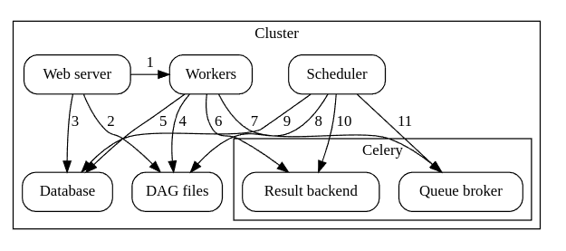

# Architecture

This section features an overview of detailed [Apache Airflow Celery Executor architecture](https://airflow.apache.org/docs/apache-airflow/stable/core-concepts/executor/celery.html#architecture){target="blank"}.

The CeleryExecutor Apache Airflow installation type consist of several components:

- **Workers**: execute the assigned tasks.
- **Scheduler**: responsible for adding the necessary tasks to the queue.
- **Web server**: HTTP Server provides access to DAG/task status information
- **Database**: contains information about the status of tasks, DAGs, Variables, connections, etc. Dagster uses [PostgreSQL](https://www.postgresql.org/){target="balnk"}.
- **Celery**: [distributed task queue](https://docs.celeryq.dev/en/stable/){target="blank"} mechanism. Dagster uses [Redis](https://docs.celeryq.dev/en/stable/getting-started/backends-and-brokers/redis.html){target="blank"} as the broker.

Apache Airflow in CeleryExecutor mode is fit for production-grade deployments.
